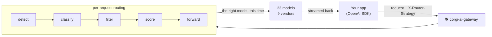
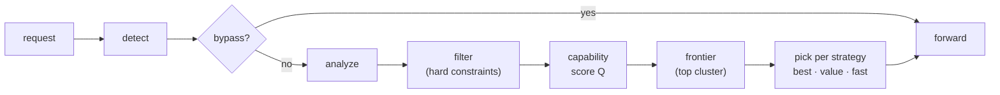
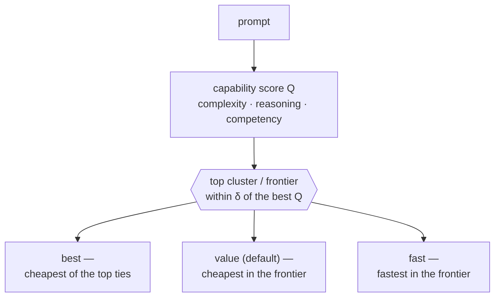

# 🐕 Corgi AI Gateway

**An OpenAI-compatible AI gateway that herds every request to the best model — automatically.**

`corgi-ai-gateway` is the service; language clients that talk to it (e.g. the .NET
[`corgi-ai-client-dotnet`](https://github.com/zhasouris/corgi-ai-client-dotnet)) share its name.

### ▶ [**Try the live decision inspector**](https://llmrouter-app.purplehill-bc78c3f6.eastus2.azurecontainerapps.io)

Type a prompt — or click a gold preset — and watch the router pick a model: the
signals it extracted, every candidate scored and ranked, which models were excluded
and why, and the headers a real OpenAI client would read back. No sign-up, no key.

*Inspector only. The deployment carries no provider keys, so it decides but never
forwards — the whole `/v1` surface answers 401. Running on Azure Container Apps
(see [deploy/azure](deploy/azure)); it scales to zero, so the first click may wait
a few seconds for a cold start.*

[](https://llmrouter-app.purplehill-bc78c3f6.eastus2.azurecontainerapps.io)


Point your existing OpenAI SDK at it instead of `api.openai.com`. It inspects each
request, decides which model best fits the work (best model, best value, or fastest),
forwards to the right provider, and streams the response straight back. No client changes
beyond the base URL.



> **About this project.** A self-hosted, production-shaped exploration of per-request LLM
> routing — built to be *read* as much as run. The design decisions are documented as ADRs,
> the routing quality is measured (not asserted), and the architecture is deliberately
> separable so a trained ML router can slot in without touching the hot path. If you're
> evaluating the engineering, start with [How it works](#how-it-works),
> [Measuring the routing](#measuring-the-routing), how we
> [rank the models](docs/model-ranking-methodology.md), and the [ADRs](docs/decisions).

---

## At a glance

- **Drop-in.** OpenAI-compatible surface — change the base URL, nothing else.
- **A real per-request decision**, not load-balancing: easy prompts fall to a cheap/fast
  model, hard prompts reserve the expensive one — per request, not per app.
- **Measured, not hoped.** A built-in eval harness scores routing against provable gold
  cases (**17/17**) and LLM-judged ground truth (**83%** accuracy, 0% over-routing).
- **Pluggable routing brain.** Deterministic heuristic, a cheap-LLM classifier, or a
  RouteLLM sidecar — all behind one `SignalProvider` interface; degrades gracefully.
- **Header-based control surface** that never touches the request body.
- **Observable by default.** OpenTelemetry throughout; per-model cost attribution.
- **Yours.** Self-hosted, config-driven, MIT. Adding a model — cloud vendor or **local LLM**
  (Ollama, vLLM, …) — is an edit, not a deploy
  ([how-to](docs/help/adding-vendors-and-local-llms.md)).

---

## Quickstart

```bash
npm install
cp .env.example .env        # then fill in provider keys
npm start                   # serves on :8000
```

or with Docker:

```bash
docker compose up -d --build              # reads .env, serves on :8000
docker compose --profile routellm up -d --build   # + the RouteLLM sidecar
```

Call it exactly like the OpenAI API — just add a routing header. `$ACCESS_TOKEN` is an
OAuth 2.0 client-credentials JWT from your IdP — see
[**Configuring OAuth**](docs/help/oauth.md) ([ADR 0015](docs/decisions/0015-client-credentials-auth.md)).
For local dev, set `AUTH_ENABLED=false` and drop the header.

```bash
curl http://localhost:8000/v1/chat/completions \
  -H "Authorization: Bearer $ACCESS_TOKEN" \
  -H "Content-Type: application/json" \
  -H "X-Router-Strategy: value" \
  -d '{"model":"auto","messages":[{"role":"user","content":"hello"}]}' -i
```

Open **`http://localhost:8000`** for the decision inspector (the same page as the
[live demo](https://llmrouter-app.purplehill-bc78c3f6.eastus2.azurecontainerapps.io)),
and **`/docs`** for a Swagger UI documenting the endpoints, the `X-Router-*` control
headers, and OAuth JWT auth. Raw spec at `/openapi.json`.

Beyond the OpenAI-compatible `/v1/chat/completions` surface:

| Endpoint | Purpose |
| --- | --- |
| `POST /v1/router/explain` | Run the full routing pipeline and return the decision trace **without** forwarding — powers the inspector. |
| `GET /v1/router/models` | Catalog with a per-model `available` flag: which models this deployment actually holds a key for. |
| `GET /v1/router/providers` | Probe each key with a real 1-token call — distinguishes a **bad key** (401) from a **retired model** (404), which look identical otherwise. Authenticated; spends a little. |

Deploying it yourself takes one command — see [deploy/azure](deploy/azure).

---

## Why this project exists

The open-source LLM tooling world is split into two halves that rarely meet:

- **Routing brains** — projects like [RouteLLM](https://github.com/lm-sys/routellm) and
  [LLMRouter](https://github.com/ulab-uiuc/LLMRouter) are excellent at *deciding* which
  model should answer a prompt. But they're research/serving frameworks for the **decision
  itself** — not something you can drop in front of an app.
- **Gateways** — projects like [LiteLLM](https://github.com/BerriAI/litellm) and Portkey
  are outstanding **proxies**: one OpenAI-format endpoint over 100+ providers, with keys,
  budgets, fallbacks, and logging. But their routing is coarse — load-balancing and
  failover, not "pick the *best* model for *this* request."

**Almost nothing open-source combines the two.** If you want a real drop-in proxy *and* a
genuine per-request model decision, you generally end up reaching for commercial products
(Martian, Not Diamond, Unify).

`corgi-ai-gateway` is that missing intersection:

> **A drop-in OpenAI-compatible proxy with a pluggable difficulty/cost/quality scoring
> engine and a clean header-based control surface — self-hosted, and yours.**

Corgi's differentiator is that it makes a real, multi-signal, per-request model decision
inside a drop-in OpenAI-compatible proxy — not just load-balancing or single-axis complexity
tiering. Every request is reduced to hard capability constraints (vision, tools, JSON, audio,
token count) plus predictive signals (complexity, reasoning depth, task type, data
sensitivity), and each eligible model is scored and ranked under a "frontier-then-optimize"
brain: capability is scored first, the top cluster is taken, then one objective — `best`,
`value`, or `fast` — is optimized within it, so price and latency never drag down a genuinely
stronger model. The whole decision is controlled by `X-Router-*` headers that never touch the
OpenAI payload, is fully inspectable via a `/router/explain` trace, and — unlike routers that
assert their quality — is measured against gold cases and LLM-judged ground truth by a
built-in eval harness. And because the routing brain sits behind a pluggable `SignalProvider`
interface (heuristic, cheap-LLM classifier, or a trained RouteLLM sidecar), the expensive ML
can improve offline from your telemetry without ever touching the hot path.

### Where it's useful

- **Cut inference spend without hand-tuning model choice.** Stop hard-coding `gpt-4.1`
  everywhere; reserve the expensive model for the work that needs it — per request.
- **One endpoint, many providers.** **33 models across 9 vendors** — OpenAI, Anthropic,
  Google, Mistral, DeepSeek, xAI, Groq, Together and Cohere — behind a single
  OpenAI-shaped API. A pluggable transformer layer talks each vendor's dialect: Anthropic
  goes over its **native Messages API**, the rest over their OpenAI-compatible endpoints,
  and adding a native adapter is one file (see [docs/transformers.md](docs/transformers.md)).
  Self-hosted / Ollama on the roadmap.
- **Per-call control without breaking the schema.** Ask for `value` on a batch job and
  `best` on a customer-facing path — via a header, body still a pristine OpenAI payload.
- **A foundation you own.** Self-hosted, config-driven, OpenTelemetry throughout.
- **A place to put a learned router.** The offline module is designed to consume your
  telemetry and improve routing over time.
- **Per-model cost breakdown.** Give each model its own vendor key (`api_key_env`) and the
  vendor's billing attributes spend per model — no custom metering (see [ADR 0007](docs/decisions/0007-per-model-api-keys.md)).

Not the right tool if you just want a passive multi-provider gateway with failover — a
mature gateway like LiteLLM already does that well, and can even sit *underneath* this as
the provider-translation layer.

---

## How it works



The routing brain is **frontier-then-optimize** ([ADR 0017](docs/decisions/0017-frontier-then-optimize-strategies.md)):
score capability first (no cost/latency in it), take the top cluster, then optimize one
objective within it — so price and speed never drag down a genuinely-stronger model.



1. **Detect** deterministic facts (token count, vision/tools/audio, JSON mode).
2. **Analyze** — a pluggable **signal provider** estimates the subjective signals
   (complexity, expected output size, reasoning depth, task type, data sensitivity). Ships
   with a deterministic heuristic and a cheap-LLM classifier; a **RouteLLM sidecar** (a
   trained difficulty model) drops in behind the same `SignalProvider` interface. Degrades
   gracefully — if the signal source fails, routing continues on deterministic signals. The
   provider is chosen **per strategy**: `latency` uses a fast signal (heuristic or RouteLLM,
   ~0–250ms) rather than the ~1s classifier whose output it barely weights
   ([ADR 0012](docs/decisions/0012-classifier-latency.md)).
3. **Filter** the model catalog by hard capability constraints (a vision request never
   routes to a non-vision model, ever).
4. **Score** every surviving model with strategy-weighted, normalized rules, then pick the
   best model this deployment can actually **reach** — a higher-scoring model with no API
   key configured is passed over, and the reason says so, rather than failing at forward time.
5. **Forward** to the chosen provider and stream the response back unchanged.

### The datapoints it collects

Every request is reduced to two kinds of signal before any model is scored.

**Deterministic facts** — extracted with no LLM call, in `detect.ts`:

| Datapoint | How it's derived |
| --- | --- |
| `inputTokens` | `gpt-tokenizer` over all message text (+4 tokens/message overhead); char-based fallback if tokenizing fails |
| `requiresVision` | any `image_url` / `input_image` content part |
| `requiresTools` | a non-empty `tools[]` or `functions[]` |
| `requiresStructuredOutput` | `response_format` of `json_object` or `json_schema` |
| `requiresAudio` | `modalities: ["audio"]` or an `input_audio` / `audio` part |

**Predictive signals** — the subjective read on the prompt, produced by a pluggable
`SignalProvider` as a normalized `ClassifierResult`:

| Signal | Range | Meaning |
| --- | --- | --- |
| `complexity` | 0..1 | How hard the request is |
| `expectedOutputTokens` | int | Predicted response length |
| `reasoningDepth` | 0..1 | How much multi-step reasoning is needed |
| `taskType` | enum | coding, math, reasoning, analysis, summarization, extraction, creative, translation, conversation |
| `dataSensitivity` | 0..1 | Presence of sensitive data (PII, secrets, medical) |

Three providers implement that one interface, and any can be swapped in via config —
graceful degradation is built in, so a failed signal source never blocks routing:

- **`llm-classifier`** (runtime default) — a cheap-LLM call in JSON mode at `temperature 0`; on any error it degrades to safe defaults.
- **`heuristic`** — deterministic keyword + length scoring, fully offline; used for the hermetic eval dry-run and as the fallback.
- **`routellm`** — a trained RouteLLM sidecar whose strong-vs-weak win-rate maps onto `complexity`; the remaining signals are backfilled from the heuristic, and it falls back entirely if the sidecar is unreachable.

Those raw signals are then turned into **eight feature rules**. Each rule owns both halves of
its logic — it extracts a normalized `0..1` signal from the request, and it knows how to
score a candidate model against that signal — so adding a routing criterion is a single
drop-in:

| Rule | Signal it reads | How it scores a model (higher = better) |
| --- | --- | --- |
| `input_tokens` | prompt size vs. 128k | favors cheap input pricing, weighted up as prompts grow |
| `expected_output` | predicted output vs. 8k | favors cheap output pricing, weighted up as output grows |
| `complexity` | `complexity` | `0.5 + (quality − 0.5)·(2·complexity − 1)` — hard prompts favor higher-capability models, easy prompts lower; continuous `quality` discriminates *within* a tier |
| `reasoning_depth` | `reasoningDepth` | rewards models that declare a `reasoning` capability |
| `task_type` | 1 if coding/math/reasoning/etc. | per-task **competency**, scaled by difficulty — an easy prompt in a hard class doesn't reserve the best-at-task model |
| `data_sensitivity` | `dataSensitivity` | biases toward local/self-hosted providers (neutral until one exists) |
| `cost` | — | `−(costPer1kInput + costPer1kOutput)` |
| `latency` | — | `−avgLatencyMs` |

Every model in the catalog (`config/models.yaml`) carries the attributes these rules read:
`tier`, `quality` (a continuous 0..1 capability score), `contextWindow`, `maxOutputTokens`,
`costPer1kInput`, `costPer1kOutput`, `avgLatencyMs`, and `capabilities` — plus an optional
per-model `api_key_env`.

### The scoring mechanism

Selection runs in three stages, and only the last one is weighted:

1. **Hard filter (constraints).** Before any scoring, every model must pass unweighted,
   strategy-independent capability gates: `vision`, `tools`, `structured_output`, `audio`,
   and a `context_window` check (`inputTokens + expectedOutput ≤ contextWindow`, and
   `expectedOutput ≤ maxOutputTokens`). A vision request can *never* reach a non-vision
   model — this is a filter, not a preference.

2. **Per-rule scoring, then normalization.** Each surviving model gets a raw score from every
   rule. Rules on incomparable native scales (dollars, milliseconds) are **min-max normalized
   to `0..1`** across the candidate set, so a weight means the same thing regardless of units.
   The capability rules whose *magnitude* is meaningful (`complexity`, `reasoning_depth`,
   `task_type`, `data_sensitivity`) are instead kept on an absolute `0..1` scale — min-max
   would stretch their spread to fill the range and erase *how much* capability matters for
   this prompt, which is exactly the signal that keeps an easy prompt's frontier wide (so
   `value`/`fast` stay cheap) and a hard prompt's narrow.

3. **Frontier, then optimize** ([ADR 0017](docs/decisions/0017-frontier-then-optimize-strategies.md)).
   The quality-family rules only (`complexity`, `reasoning_depth`, `task_type`/competency —
   **not** cost or latency) form a **capability score `Q`**: *how good is this model for this
   task?* The **frontier** is every model within `δ` (default 12%) of the top `Q`. Then the
   strategy optimises **one** objective *within* the frontier — so price and speed never drag
   down a genuinely-stronger model. `X-Router-Reason` reports which and why.

A **strategy chooses the objective within the frontier** (`config/strategies.yaml`):

| Strategy | Optimises within the frontier | Intent |
| --- | --- | --- |
| `best` | cheapest within the *tie-band* of the top `Q` | the strongest, without overpaying for noise |
| `value` *(default)* | min blended cost | strongest that's also economical |
| `fast` | min latency | soonest among the genuinely-capable |

`best` isn't a hard argmax: models within `tie_epsilon` (≈5%) of the top `Q` are treated as
statistically tied (that gap is benchmark noise), so it takes the **cheapest** of them — a
model must be *meaningfully* better to cost more.

Because `complexity` and `task_type` both scale with difficulty — `complexity` tilts a
continuous `quality` score by `(2·complexity−1)`, and competency's spread shrinks toward neutral
on easy prompts — `Q` is difficulty-aware: a trivial prompt's frontier is *wide* and `value`/`best`
land on a cheap model, while a hard prompt's narrows to the strong ones. Continuous `quality` also
means `Q` no longer collapses to a handful of tier constants — models rank distinctly, and
`X-Router-Reason` names the runner-up and the deciding attribute (cost/latency) so a within-frontier
pick is legible ([ADR 0019](docs/decisions/0019-continuous-capability-and-difficulty-scaled-competency.md)).
Cost/speed caps compose on top: `X-Router-Max-Cost` bounds price on any strategy. Adding a criterion
is one new rule file; the frontier width `δ` is one knob.

### Where the capability numbers come from

`quality` (the continuous capability composite) and the per-task `competency` scores are
**benchmark-seeded, not guessed.** They were assembled by per-vendor web research fanned across
parallel agents: for each model, each category score is the **mean of the available normalized
(0–100) public benchmarks** for that category — and left `null` when the web turned up none
(never invented). The `quality` **composite** is a weighted average of the available categories
(reasoning and coding weighted highest), with any missing category's weight redistributed. Every
number carries its **source and date** in
[`docs/process/model-scores.json`](docs/process/model-scores.json); `competency.yaml` records
provenance per entry ([ADR 0010](docs/decisions/0010-per-task-competency-scores.md)) and `quality`
is injected into `models.yaml` from the composite
([ADR 0019](docs/decisions/0019-continuous-capability-and-difficulty-scaled-competency.md)).

Treat these as **directional, not authoritative.** Vendors publish different benchmark variants, so
cross-vendor comparison within a category is approximate; classic suites (MMLU/HumanEval-class) may
be saturated or contaminated; and several 2026 flagships publish few classic benchmarks, so their
composite is partial. Because it's all config, re-sourcing is an edit — regenerate
`model-scores.json` and re-run the injection when better data lands. Full account, including how
the router consumes these numbers per request:
**[Model Ranking Methodology](docs/model-ranking-methodology.md)**.

### Control it with headers (never the body)

| Header | Effect |
| --- | --- |
| `X-Router-Strategy: best \| value \| fast` | Objective within the capability frontier (default `value`) |
| `X-Router-Bypass: true` | Skip routing; use the body's `model` verbatim |
| `X-Router-Max-Cost: <usd per 1k>` | Cost ceiling |

And it tells you what it did, on every response:

| Response header | Meaning |
| --- | --- |
| `X-Router-Model` | The model it chose |
| `X-Router-Reason` | Why |
| `X-Router-Warning` | Soft warnings (e.g. classifier degraded, unknown strategy) |

The design rationale for every one of these choices lives in [`docs/decisions/`](docs/decisions) as ADRs.

---

## Measuring the routing

A router is only as good as its decisions, so the project ships an **evaluation harness**
that turns "is it any good?" into numbers — two ways, each honest about what it proves:

| Method | What it proves | Result |
| --- | --- | --- |
| **Provable gold cases** (`test/gold.test.ts`) | Requests whose correct target is *objectively determinable* (vision → vision model; pure-`cost` → cheapest; bypass → verbatim; audio → error; easy vs. hard math/coding → cheap tier vs. reasoning model) | **17/17** |
| **Quality-judged accuracy** (`npm run eval:judge`) | For each prompt, a weak and a strong model both answer, an LLM judge decides whether the strong answer was *meaningfully* better, and the router's choice is scored against that ground truth | **83% accuracy · 0% over-routing · 17% under-routing** (value, 12-prompt set) |

Two honest limits on that judged number. It is **n=12**, so a single prompt moves it by 8
points — treat it as a smoke test, not a benchmark. And the harness runs the *deterministic
heuristic* signal provider, not the LLM classifier that production defaults to; both
under-routes below are prompts the heuristic mis-reads (see [TODO item 4](docs/TODO.md)).
Re-measured after the [ADR 0003 `fixedScale`](docs/decisions/0003-rule-and-scoring-engine.md)
scoring change and unchanged by it — 0% over-routing held, which is the property that matters
for spend.

```bash
npm run eval          # dry-run: strategies vs. baselines + estimated cost (hermetic)
npm run eval:judge    # quality-judged accuracy (makes real model calls; spends)
```

**Honest caveats:** the judged number is a small set with a single judge model, and the
default signal is a coarse heuristic — closing the gap is exactly what the RouteLLM signal
is for. The harness is the feedback loop that will *prove* whether it helps. Spec:
[`docs/eval-harness.md`](docs/eval-harness.md).

---

## Architecture & design decisions

The engineering choices are documented as **Architecture Decision Records** in
[`docs/decisions/`](docs/decisions) — the reasoning, the alternatives weighed, and the
tradeoffs accepted. Highlights:

- **Brain/gateway separation** — the fast forwarding path and the expensive routing
  intelligence are decoupled, so a learned router can be promoted in without a rewrite.
- **`SignalProvider` interface** — heuristic, LLM classifier, and RouteLLM sidecar are
  interchangeable behind one contract, with graceful degradation.
- **Config over code** — catalog, strategies, and classifier are all YAML; adding a model
  is an edit, not a deploy.
- **Per-model API keys** ([ADR 0007](docs/decisions/0007-per-model-api-keys.md)) — vendor
  billing does the cost attribution, no custom metering.

Testing rules and invariants: [`docs/TESTING.md`](docs/TESTING.md).

---

## Implementations

The primary runtime is **TypeScript** (this repo, `main`). A **Python** runtime (FastAPI)
with equivalent behavior lives on the `feature/python-implementation` branch. ADRs
0001–0003 and 0005–0007 are shared by both; ADR 0004 documents each stack.

### Stack (TypeScript)

Hono (+ `@hono/node-server`), Zod for config validation, the `openai` SDK for the
classifier call, global `fetch` for streaming passthrough, `gpt-tokenizer` for token
counting, OpenTelemetry, run via `tsx`. The signal source is a pluggable `SignalProvider`
(heuristic / LLM classifier / RouteLLM sidecar). See [ADR 0004](docs/decisions/0004-stack-and-project-layout.md).

---

## Configuration

| File | Holds |
| --- | --- |
| `.env` | Secrets — provider keys, optional per-model keys (gitignored; copy from `.env.example`). OAuth issuer/audience are non-secret and live here or in `server.yaml` |
| `config/server.yaml` | Classifier, OTel, auth, provider endpoints |
| `config/models.yaml` | Model catalog (cost, context, capabilities, tier, optional `api_key_env`) |
| `config/strategies.yaml` | Capability weights, frontier width, per-strategy objective (ADR 0017) |
| `sidecar/` | Optional RouteLLM signal sidecar (Python) — see its README |

**Per-model keys** (optional): a model in `models.yaml` may set `api_key_env` to
authenticate its own calls with a dedicated vendor key; otherwise it falls back to the
provider default.

---

## Tests

```bash
npm test          # vitest — 182 tests incl. gold routing + judging logic (hermetic)
npm run typecheck # tsc --noEmit
npm run eval      # dry-run routing eval (strategies vs. baselines)
npm run eval:judge# quality-judged accuracy (spends — real model calls)
```

---

## Status & roadmap

**Now:** OpenAI-compatible surface over **33 models / 9 vendors**; a pluggable transformer
layer (Anthropic native Messages API, OpenAI-compat passthrough for the rest —
[docs/transformers.md](docs/transformers.md)); pluggable signal (heuristic / LLM classifier
/ RouteLLM sidecar); strategy-weighted scoring; header control; streaming; per-model API
keys; OpenTelemetry (traces, metrics, logs); Docker; evaluation harness (dry-run + provable
gold + quality-judged accuracy); CI (typecheck, tests, coverage floors) + security scanning
(SAST + DAST).

**In progress / deferred** (full backlog: [docs/TODO.md](docs/TODO.md)):

- **RouteLLM shadow-eval → promotion** ([ADR 0006](docs/decisions/0006-leveraging-learned-routing.md)): the sidecar +
  `SignalProvider` are built; the accuracy lift vs. the heuristic is not yet benchmarked
  through the judge.
- Native transformers for the remaining vendors (Gemini, Cohere, …) — they work today over
  their OpenAI-compatible endpoints; native adapters are a fidelity upgrade, tracked as a
  checklist in [docs/transformers.md](docs/transformers.md).
- Self-hosted / Ollama backends.
- Offline, telemetry-fed ML router ([ADR 0005](docs/decisions/0005-offline-ml-module.md)).
- Automatic cross-provider failover.
- **Sensitive-data routing** — enforce data-handling policy as a hard, fail-closed
  constraint ([ADR 0009](docs/decisions/0009-sensitive-data-routing.md), planned).
- **Per-task competency scores** and **hybrid "prefer X among near-equals" selection**
  ([ADR 0010](docs/decisions/0010-per-task-competency-scores.md),
  [ADR 0011](docs/decisions/0011-lexicographic-tie-break.md), planned).
- **Classifier latency** — the router adds ~1s, essentially all of it one LLM call; caching
  and a bounded response are free wins ([ADR 0012](docs/decisions/0012-classifier-latency.md),
  planned).

### Decision record

Every significant design decision is written down, including the ones not yet built.
**Accepted** means shipped and in the code; **Proposed** means the plan is agreed and the
implementation is open.

| ADR | Decision | Status |
|---|---|---|
| [0001](docs/decisions/0001-multi-provider-translation-strategy.md) | Multi-provider translation — hub-and-spoke adapters | ✅ Accepted |
| [0002](docs/decisions/0002-router-header-contract.md) | Router header contract (control + response headers) | ✅ Accepted |
| [0003](docs/decisions/0003-rule-and-scoring-engine.md) | Rule & scoring engine — constraints filter, scores rank | ✅ Accepted |
| [0004](docs/decisions/0004-stack-and-project-layout.md) | Stack & project layout (TypeScript) | ✅ Accepted |
| [0005](docs/decisions/0005-offline-ml-module.md) | Offline ML as a separate, telemetry-fed module | ✅ Accepted |
| [0006](docs/decisions/0006-leveraging-learned-routing.md) | Learned routing (RouteLLM) behind the `SignalProvider` seam | ✅ Accepted |
| [0007](docs/decisions/0007-per-model-api-keys.md) | Per-model API keys for cost attribution | ✅ Accepted |
| [0008](docs/decisions/0008-observability.md) | Observability — metrics, logs, Azure Monitor | ✅ Accepted |
| [0009](docs/decisions/0009-sensitive-data-routing.md) | Sensitive data → approved providers, as a fail-closed **constraint** | 📋 Proposed |
| [0010](docs/decisions/0010-per-task-competency-scores.md) | Per-task competency scores instead of a single `tier` scalar | ✅ Accepted |
| [0011](docs/decisions/0011-lexicographic-tie-break.md) | Lexicographic tie-break — `quality-prefer-cost` and friends | 📋 Proposed — unblocked |
| [0012](docs/decisions/0012-classifier-latency.md) | Cut classifier latency — the router's entire overhead is one LLM call | 🟡 Partial — `latency` uses a fast signal (done); caching planned |
| [0013](docs/decisions/0013-routellm-sidecar-transport.md) | Keep the HTTP sidecar (reject CLI); the real lever is the embedding hop | ✅ Accepted — local-embedding follow-up open |
| [0014](docs/decisions/0014-dotnet-client-and-prerequisites.md) | Official .NET client (Semantic Kernel) + the router-side headers it needs | 📋 Proposed — R2 shipped; R1/R3/R4 open |
| [0015](docs/decisions/0015-client-credentials-auth.md) | Protect `/v1` with OAuth 2.0 client-credentials JWTs (replaces static keys) | ✅ Accepted |
| [0016](docs/decisions/0016-google-sign-in-for-the-inspector.md) | Inspector auth — Google Sign-In for `/demo`, anonymous `/v1/router/explain` | 📋 Accepted — not yet implemented |
| [0017](docs/decisions/0017-frontier-then-optimize-strategies.md) | Frontier-then-optimize routing — `best` / `value` / `fast` | ✅ Accepted |
| [0018](docs/decisions/0018-base-model-delta-kpis.md) | Base-model delta report — cost & targeted-accuracy KPIs (`eval:baseline`) | ✅ Accepted |
| [0019](docs/decisions/0019-continuous-capability-and-difficulty-scaled-competency.md) | Continuous capability index (`quality`) + difficulty-scaled competency | ✅ Accepted |

---

## Related & prior art

- **Routing brains:** [RouteLLM](https://github.com/lm-sys/routellm),
  [LLMRouter](https://github.com/ulab-uiuc/LLMRouter),
  [vLLM Semantic Router](https://vllm-semantic-router.com/)
- **Gateways:** [LiteLLM](https://github.com/BerriAI/litellm), Portkey, OpenRouter,
  Cloudflare AI Gateway

This project's niche is the **overlap** of those two lists.

---

## License

[MIT](LICENSE)